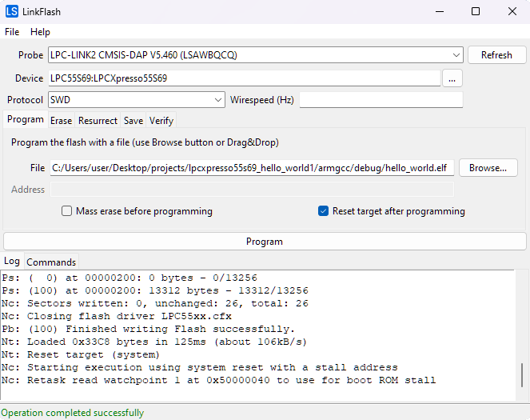

# Overview
[LinkServer](https://www.nxp.com/design/software/development-software/mcuxpresso-software-and-tools-/linkserver-for-microcontrollers:LINKERSERVER) is a utility for launching and managing GDB servers for LinkServer capable probes.
A GDB client can then be used to connect to the server and debug applications running on the target MCU.

This readme describes the functionalities that *LinkServer* has, as well a quickstart showing how to start the server and how to use *GDB* to connect to it.

Refer to [LinkServer integration with IDEs](docs/LinkServer-IntegrationWithIDEs.md) for additional details regarding the LinkServer usage in IDEs.


# Functionalities
- lists the supported devices
- lists the available probes (connected); boots LPC-Link1 and LPC-Link2 probes found in DFU mode
- loads all JSON data files and reports potential errors (schema validation)
- can export the configuration of any device to a JSON file, which can be used to customize the device configuration
- allows overriding the device configuration from CLI (e.g. coreindex, wirespeed, flash driver, reset type, etc.)
- can launch and manage [GDB servers](docs/LinkServer-GDBServer.md)
- can execute flash operations (i.e. erase, load, verify, etc.) without *GDB*
- can run applications without *GDB*, suitable for testing purposes in CI/CD environments
- can control target boot configuration by driving the MCU-Link ISP_CTRL pins (available for probe, gdbserver and flash commands)
- can execute probe specific commands:
  - update the firmware on a MCU-Link probe if needed, without physical intervention
  - show CMSIS-DAP probe information for a particular probe
  - run a low-level script
  - issue a wire timed reset
- [low level functions](docs/LinkServer-LowLevelFunctions.md)
- [scripting support](docs/LinkServer-ScriptingSupport.md)
- [flash drivers](docs/LinkServer-FlashDrivers.md)
- [miscellaneous configurations](docs/LinkServer-MiscellaneousConfigurations.md)

# Limitations
On multi-core targets, the `flash` and `run` operations are supported only on the primary core.
To program a flash region associated with a secondary core, use the corresponding region as mapped to the primary core.

Legacy LPC-Link1 / LPCXpresso V1 probes may fail to boot or function on certain Windows 10 and Windows 11 systems due to DFU driver compatibility issues.
For Windows 10 systems the HVCI feature causes driver error code 39. To disable HVCI, set the 'Enabled' key to 0 (DWORD) value in HKEY_LOCAL_MACHINE\SYSTEM\CurrentControlSet\Control\DeviceGuard\Scenarios\HypervisorEnforcedCodeIntegrity
For Windows 11 systems, a possible workaround is to disable the Memory Integrity feature in Windows Security. More details [here](https://support.microsoft.com/en-us/windows/a-driver-can-t-load-on-this-device-8eea34e5-ff4b-16ec-870d-61a4a43b3dd5).

# Quickstart
This quickstart will present how to start debugging a FRDM-K64F board using *LinkServer* and *GDB*.

The GDB server can be started using the `gdbserver` command. We need to provide a `<DEVICE_NAME>:<BOARD>`
pair identifying the device we are debugging. We know the board name, so let's try\
`./LinkServer gdbserver :k64f`.

```
Family    Device     Board         Cores
--------  ---------  ------------  -------
K6x       MK64FN1M   FRDM-K64F     cm4
K6x       MK64FN1M   TWR-K64F120M  cm4
K6x       MK64FX512  FRDM-K64F     cm4

CRITICAL: Multiple devices match the given substring, but none of them were exact matches. Please use the full <DEVICE_NAME>:<BOARD> pair to select the device.
```
Three devices were found containing 'k64f' in their board name. In order to select one, we can provide the full
`<DEVICE_NAME>:<BOARD>` pair:\
`./LinkServer gdbserver MK64FN1M:FRDM-K64F`\
In this particular case, we could
have also used `./LinkServer gdbserver n1:frdm-k64f`, since 'n1' is enough to discriminate between the two devices available for the FRDM-K64F board.

At this point, you might get an error if you have multiple probes connected.
```
  #  Description                                    Serial                                            Device    Board         Capabilities
---  ---------------------------------------------  ------------------------------------------------  --------  ------------  ----------------
  1  MCU-LINK FRDM-MCXN236 (r0E7) CMSIS-DAP V3.167  0IIDCTJPZV20K                                     MCXN236   FRDM-MCXN236  DEBUG, VCOM, SIO
  2  CMSIS-DAP                                      0240000048824e450034700bdd89002e8761000097969900                          DEBUG

CRITICAL: Multiple probes detected, please specify a probe serial or index using --probe.
```
You need to specify the probe index using `-p` option. For example\
`./LinkServer gdbserver n1:frdm-k64f -p #2`.

Now the GDB server should be running and you should see some messages in the console.
```
INFO: Selected device MK64FN1M0xxx12:FRDM-K64F
INFO: Selected probe #2 0240000048824e450034700bdd89002e8761000097969900 (CMSIS-DAP)
INFO: GDB server listening on port 3333 in debug mode (core cm4)
INFO: Semihosting server listening on port 4444 (core cm4)
```
This tells us that the server is awaiting a connection from *GDB* on port 3333.
A semihosting server is also listening on port 4444. If your application uses semihosting you should connect to this server now using telnet or something similar.

Let's start *GDB*:\
`arm-none-eabi-gdb <PATH_TO_ELF_FILE>`\
and then issue the following commands:
1. `target remote :3333` to connect to the server.
2. `mon semihost ena` to enable semihosting
3. `load` to download the application to the board. You should always issue a `load` after connecting, even in attach mode.

We can now debug the target from *GDB* (i.e. place breakpoints, continue and suspend the target, read registers, etc.).\
The GDB server will automatically close when the *GDB* disconnects.
The server can also be closed form the terminal using CTRL+C.

## Multicore
By default, *LinkServer* will start a GDB server for the primary core only. Option `--core all` can be used to start
one server for each core. The servers for the secondary cores are started in attach mode.

As an example, we will use LPC55S69 with a multicore application.
Start the server using\
`./LinkServer gdbserver 55s69 -c all`.
```
INFO: Selected device LPC55S69:LPCXpresso55S69
INFO: Booting LPC-LINK 2 probe
INFO: Selected probe #1 I3FWNTIW (LPC-LINK2 CMSIS-DAP V5.361)
INFO: GDB server listening on port 3333 in debug mode (core cm33_core0)
INFO: Semihosting server listening on port 4444 (core cm33_core0)
INFO: GDB server listening on port 3334 in attach mode (core [cm33_core1])
INFO: Semihosting server listening on port 4445 (core [cm33_core1])
```
We can see that two GDB servers were started. The one for the primary core (cm33_core0) is listening on port 3333, and
the one for the secondary core (cm33_core1) is listening on port 3334. Also notice that the secondary cores are
always displayed surrounded by square brackets.

First, start *GDB* and connect to the primary server. This time we will specify all the *GDB* commands from the command line:\
`arm-none-eabi-gdb <PATH_TO_ELF_FILE> -ex "target remote :3333" -ex "mon semihost ena" -ex "load"`.

Next, start another *GDB* for the secondary core:\
`arm-none-eabi-gdb <PATH_TO_ELF_FILE> -ex "target remote :3334" -ex "mon semihost ena" -ex "load"`.

Note that the server for secondary core is in attach mode but we still need to execute "load",
even though the server doesn't actually re-write to flash/RAM.

Now you should be able to debug from *GDB* as usual. The *LinkServer* program will close when both *GDB* instances
disconnect. CTRL+C in the *LinkServer* terminal can also be used to close all instances.

## Custom device configurations
The command `./LinkServer gdbserver <DEVICE_NAME>:<BOARD>` instructs *LinkServer* to use a certain device configuration
from the *devices* folder. In case we want to use a custom device, we can pass a JSON file instead of the device name
and board pair.

Let's use `device <DEVICE_NAME>:<BOARD> export FILE` to extract a device's configuration, edit it and then pass it back to `gdbserver`.\
Using the FRDM-K64F board again, we can run:\
`./LinkServer device k64fn:frdm export myconfig.json`\
to extract the configuration
for this device into the *myconfig.json* file.
```
INFO: Selected device MK64FN1M0xxx12:FRDM-K64F
INFO: Device data written to myconfig.json
```

As an example we will edit the `/board` property to change the board name, and delete the `/debug/connect-script` property.
*myconfig.json* after the changes:
```json
{
  "copyright": "Copyright 2024 NXP",
  "license": "SPDX-License-Identifier: BSD-3-Clause",
  "version": "1.1.0",
  "vendor": "NXP",
  "devices": [
    {
      "board": "Custom configuration for FRDM-K64F",
      "device": {
        "id": "MK64FN1M0xxx12",
        "name": "MK64FN1M",
        "family": "K6x",
        "memory": [
          {
            "location": "0x00000000",
            "size": "0x00100000",
            "type": "Flash",
            "flash-driver": "FTFE_4K.cfx"
          },
          {
            "location": "0x20000000",
            "size": "0x00030000",
            "type": "RAM"
          },
          {
            "location": "0x1fff0000",
            "size": "0x00010000",
            "type": "RAM"
          },
          {
            "location": "0x14000000",
            "size": "0x00001000",
            "type": "RAM"
          }
        ],
        "cores": [
          {
            "type": "cm4",
            "name": "cm4"
          }
        ]
      },
      "debug": {
        "protocol": "swd",
        "swo": true,
        "masserase-script": "kinetismasserase.scp"
      }
    }
  ]
}
```

The new configuration can be used via the following command:\
`./LinkServer gdbserver myconfig.json`
```
INFO: Selected device MK64FN1M0xxx12:Custom configuration for FRDM-K64F
INFO: Selected probe #1 0240000048824e450034700bdd89002e8761000097969900 (CMSIS-DAP)
GDB server listening on port 3333 in debug mode (core cm4)
Semihosting server listening on port 4444 (core cm4)
```

Notice that the new board name appears in the output log.\
You can check out the meaning of each property using the JSON Schema located at *devices/devices.schema.json*.
If you prefer a more human-readable format, the schema is available in HTML or Markdown form in the *docs/* folder.

# Logging
By default, *LinkServer* only logs messages up to *INFO* level.

The logging level can be controlled using the `--log-level <level>` option. `<level>` should be in the range `0-5`, corresponding to `DISABLED`, `CRITICAL`, `ERROR`, `WARNING`, `INFO`, `DEBUG`.

Therefore, full *DEBUG* logging can be enabled using `--log-level 5`. The short form `-l5` is also accepted.

*Note*: If provided, the `--log-level` option **MUST** be placed before any other command.

Examples:
- `./LinkServer -l5 probes`
- `./LinkServer -l5 flash --probe #2 k64fn:frdm load hello_world.axf --erase-all`

# Commands
If no arguments are supplied the launcher will print a help message and then exit, same as `./LinkServer -h`.
This help message also contains all the commands that *LinkServer* supports.

The documentation below only presents the most important options. The commands may contain additional options
which can be printed using the `help` command.

## Help
`help [CMD]` prints the help for another command. Examples:
- `./LinkServer help gdbserver`
- `./LinkServer help flash erase`
- `./LinkServer help probe update`

## Probes
`probes` lists and boots all connected probes.

## Probe
`probe PROBE_ID COMMAND` can be used to run some probe specific commands:
- `update <mode>`: Firmware update operations for the selected MCU-Link probe
- `dapinfo`: Shows CMSIS-DAP probe information for the selected probe
- `runscript FILE`: Loads and runs a LinkServer scp (BASIC-like) script
- `wiretimedreset <milliseconds>`: Issues a wire timed reset
- `wirebootconfig <data>`: Controls target boot configuration by driving the MCU-Link ISP_CTRL pins

Use `./LinkServer help probe update|dapinfo|runscript|wiretimedreset|wirebootconfig` for more information and individual options for each probe command.

## Devices
`devices` lists all builtin supported devices. The devices are listed in a table, showing the device family, device name,
board name and cores. Note that the secondary cores are always displayed surrounded by square brackets.

Results can be filtered by device name and board using `--filter <DEVICE_NAME>:<BOARD>`. Filtering is case insensitive.
If an exact match is found, only that match is shown. Otherwise, filtering is done using substrings.

*Note*: The `Device` column shows entries with a shorter, friendlier name instead of full device ID by default
(for example MIMXRT1064 instead of MIMXRT1064xxxxA). To show the full device IDs (as defined in datasheets,
MCUXpresso SDKs, Open-CMSIS-Packs), pass the `--id` flag to the `devices` command. This flag only affects how
the device names are displayed, not the functionality itself. When selecting devices or filtering for devices,
both forms of device names are checked for a match.

Examples:
- No filter: `./LinkServer devices`
- No filter, show full device names: `./LinkServer devices --id`
- Filter by device name: `./LinkServer devices -f k64f`
- Filter by board name: `./LinkServer devices -f :frdm`
- Filter by device name and board: `./LinkServer devices -f k64f:frdm`

## Device
`device DEVICE COMMAND` can be used to list or export a device's JSON configuration.
`DEVICE` must be a `<DEVICE_NAME>:<BOARD>` pair (see `devices --filter` for details).

The available subcommands are:
- `info`: Display the device's JSON configuration in an easy to read format.
- `export FILE`: Export the device's JSON configuration data to FILE.

  The exported JSON can be edited and then passed to commands that require target specification, like `gdbserver`, `flash` or `run`.

  The schema for the JSON file can be found at *devices/devices.schema.json*.
  A more human-readable HTML or Markdown version of the schema can be found in the *docs/* folder.

  Example: `./LinkServer device k64fn:frdm export myconfig.json`.
  After editing the file, the custom device can be used like so: `./LinkServer gdbserver myconfig.json`.

## Gdbserver
`gdbserver DEVICE` starts and manages a gdbserver and a telnet server for semihosting.

`DEVICE` specifies the device that the probe is connected to.
It can be either a `<DEVICE_NAME>:<BOARD>` pair (see `devices --filter` for details), or a device configuration file
ending in `.json` which can be generated by the `config` command presented above.

It is not necessary to specify the probe if only one is connected. Otherwise, the probe serial/index must be specified
using `--probe TEXT`. If `TEXT` starts with `#`, then it interpreted as the probe index, otherwise it is interpreted
as a probe serial substring (case insensitive).

After starting, *GDB* can connect using `target remote :3333`.
After connecting, a `load` command **MUST** be issued from *GDB*, even in attach mode.
If semihosting will be used, `mon semihost ena` **MUST** also be issued.

**Attach** mode can be forced using `--attach`. `load` command still needs to be issued from *GDB* after connecting.

A **semihosting** telnet server is also started with the default port 4444.
Semihosting still needs to be enabled by executing `monitor semihost enable` from GDB.
If you want to use semihosting through *GDB* (not through telnet), first disable the telnet server using `--semihost-port -1`,
then after connecting with *GDB* execute `set mem inaccessible-by-default off` and `mon semihost ena`.

For **multicore** boards, one gdbserver and semihost server can be started per core. By default, the launcher will start
the server only for the primary core. All cores can be specified using `--core all`. Alternatively, specific cores can be
selected using the `-c` option multiple times (e.g. `-c cm7 -c cm4`). When multiple cores are used, non-primary cores
are always started in attach mode.

**Ports** can be specified using `--gdb-port` and `--semihost-port` options. If these ports are not specified,
*LinkServer* will try several ports starting from 3333 and 4444 respectively. If the port options are used, an error
will occur if the exact given port is not free. Additionally, `--semihost-port -1` will disable semihosting through telnet.
When using multiple cores, the ports are automatically incremented for each gdbserver instance.

Examples:
- Select device by substring:\
`./LinkServer gdbserver 55s69`
- Select device by full device name and board:\
`./LinkServer gdbserver MIMXRT1176xxxxx:MIMXRT1170-EVK`
- Select probe by index:\
`./LinkServer gdbserver MIMXRT1176xxxxx:MIMXRT1170-EVK -p #2`
- Start in attach mode:\
`./LinkServer gdbserver MIMXRT1176xxxxx:MIMXRT1170-EVK -a`
- Start one server for each core:\
`./LinkServer gdbserver MIMXRT1176xxxxx:MIMXRT1170-EVK -c all`

## Flash
`flash DEVICE COMMAND` can be used to perform flash operations without *GDB*. The supported commands are:
- `erase`: Erase all flash
- `load FILE...`: Program the flash with the given FILE arguments
- `verify FILE...`: Verify that the flash contents match the given FILE arguments
- `blank`: Check that the specified flash region is blank
- `resurrect`: Attempt to unlock the device by running masserase-script

Use `./LinkServer help flash erase|load|verify|blank|resurrect` for more information and individual options for each flash command.

Additionally, the `flash` command supports several connection options (i.e. `DEVICE`, `--probe`), with the same meaning
as for the `gdbserver` command. Use `./LinkServer help flash` for more information and options.

*Note*: As the help suggests, the options for the `flash` command must be supplied before `DEVICE`.

Examples:
- Mass-erase flash and program it using an ELF file:\
`./LinkServer flash --probe #2 k64fn:frdm load hello_world.axf --erase-all`
- Load an ELF file and two binaries at offsets 0x20000 and 0x22000 respectively:\
`./LinkServer flash --probe #2 k64fn:frdm load hello_world.axf data1.bin:0x20000 data2.bin:0x22000`

Refer to [LinkServer Flash Drivers](docs/LinkServer-FlashDrivers.md) for additional details regarding the *LinkServer* flash support.

### GUI
`gui flash` opens an application window for executing common flash operations using the graphical user interface.
Refer to [LinkFlash](docs/LinkFlash.md) for additional details regarding the GUI flash support.

Example:
- `./LinkServer gui flash`



## Runner
`run [OPTIONS] DEVICE FILE` can be used to load, start execution, send input and monitor output of applications for testing purposes without *GDB*. The runner is suitable for integration in a CI/CD environment like *CTest*.

`FILE` is a path to an ELF (.axf|.elf), HEX (.hex), SREC (.s19|.s28|.s37|.srec), or binary (any other extension, if not detected as one of the other types) file. In the case of a binary file, the `--addr` option must also be supplied.

The test application's output (either via semihosting or UART port) is captured and printed on the console. Termination is determined based on a configurable exit marker printed by the application, or based on exit system call (for semihosting only).
Any (interactive) user input into the console is made available to the application's standard input. It is also possible to specify as a command-line option some predetermined text input to be passed to application's standard input.
The output can be checked against specified pass and/or fail markers and the return code is set accordingly. If the specified fail string is detected, return code is set to non-zero. Similarly, if the specified pass string is not detected, the return code is set to non-zero.
An optional timeout can be specified to limit the time the output is being monitored after loading the application. Use value 0 to exit immediately after loading and sending any predetermined input. The return code is not modified in case the timeout expires.

The relevant options are:
- `--mode`: I/O mode: `semihost` or `serial:PORTNAME:BAUDRATE`
- `--send TEXT`: Send (predetermined) input to application
- `--args-mark TEXT`: Marker to wait for before sending input to application; if not specified the input is sent immediately after starting the application
- `--exit-mark TEXT`: Marker to detect application termination \[default: \*STOP\*\]
- `--pass-mark TEXT`: Pass string - if specified the output is checked against it; return code is set to 0 if detected, non-zero otherwise
- `--fail-mark TEXT`: Fail string - if specified the output is checked against it; return code is set to non-zero if detected, 0 otherwise
- `--exit-timeout INTEGER` : Timeout (seconds) to wait for application termination (return code is not changed based on expiration)
- `--pause`: Pause for key press on exit

The `run` command supports several common connection options (i.e. `DEVICE`, `--probe`), with the same meaning
as for the `gdbserver` command.

*Note*: The connection options for the `run` command must be supplied before `DEVICE`.

The `--log-level` option controls the amount of information displayed on the console: at level 3 and below, only the application output is shown; level 5 includes extended information suitable for debugging purposes only. If not set, logging level defaults to 4.

Use `./LinkServer help run` for more information and options.

Examples:
- Run ELF application using semihosting I/O, connect via probe #1 and pass "test=2" to application.\
`./LinkServer run --probe #1 --mode semihost --send "test=2" --args-mark "*ARGS*" k64fn:frdm hello_world.axf`
- Run SREC application and capture its output using /dev/ttyACM0 serial port; use marker \*\*\*DONE\*\*\* to indicate termination. Since no probe is specified, it assumes there is only one probe connected.\
`./LinkServer run LPC55S36 --mode serial:/dev/ttyACM0:115200 --exit-mark "***DONE***" test_app.s19`
- Run binary application at 0x0 address using semihosting I/O; check output for \*\*\* FAILED \*\*\* marker and set return code accordingly.\
`./LinkServer run LPC55S16 --fail-mark "*** FAILED ***" test_app.bin --addr 0x0`
- Run application and exit immediately (don't wait for markers).\
`./LinkServer run MCXN947 test.elf --exit-timeout 0`


## Target boot configuration
Besides the connection options available for `gdbserver`and `flash` commands, there is an option (`--bootconfig <data>`)
which allows controlling the target boot configuration by driving the MCU-Link ISP_CTRL pins during resets.

This option is aimed to be used for board designs with on-board MCU-Link probe (running firmware version 3.108 or later).
For more details about the `--bootconfig <data>` option, check the help available for `gdbserver`and `flash` commands.

User friendly names for boot modes can be defined in the JSON files for any device.
For example, LPCXpresso55S36.json has the following "friendly" boot configuration names:
```json
        "bootconfigs": {
          "internal": "xx00",
          "isp": "xx01",
          "flexspi": "xx10",
          "auto": "xx11"
        }
```
Examples:
- `flash` command using boot configuration called `internal` in the JSON file:\
`./LinkServer flash --bootconfig internal lpc55s36 load lpcxpresso55s36_led_blinky.axf`
- `gdbserver` and `flash` commands using various boot configurations:\
`./LinkServer gdbserver --bootconfig xx00 lpc55s36`\
`./LinkServer gdbserver --bootconfig flexspi lpc55s36`\
`./LinkServer flash --bootconfig xx10 lpc55s36 load lpcxpresso55s36_hello_world_qspi_xip.axf`
- turn off previous target boot configuration:\
`./LinkServer gdbserver --bootconfig xxxx lpc55s36`

## Automatic MCU-Link firmware update

The automatic firmware update is supported for MCU-Link probes running MCU-Link CMSIS-DAP firmware V3.122 or later.
Examples:

- List the connected probes: `.\LinkServer probes`
```
  #  Description                       Serial         Device    Board    Capabilities
---  --------------------------------  -------------  --------  -------  ----------------
  1  MCU-LINK (r0FF) CMSIS-DAP V3.122  OZ1UW42JY1TF1                     DEBUG, VCOM, SIO
```

- Check if a firmware update is needed for the selected MCU-Link probe: `.\LinkServer probe '#1' update check`
```
INFO: Selected probe #1 OZ1UW42JY1TF1 (MCU-LINK (r0FF) CMSIS-DAP V3.122)
INFO: MCU-Link firmware update `check`: Probe ([OZ1UW42JY1TF1] [MCU-LINK (r0FF) CMSIS-DAP V3.122]) is running a firmware version which is older than the included firmware version [3.146]
Firmware update `check`: recommended - auto update can be performed using: `LinkServer probe #1 update auto`
```

- Perform the automatic firmware update: `.\LinkServer probe '#1' update auto`
```
INFO: Selected probe #1 OZ1UW42JY1TF1 (MCU-LINK (r0FF) CMSIS-DAP V3.122)
INFO: MCU-Link firmware update `auto`: Probe ([OZ1UW42JY1TF1] [MCU-LINK (r0FF) CMSIS-DAP V3.122]) is running a firmware version which is older than the included firmware version [3.146] and will be updated
INFO: Preparing the selected probe ([OZ1UW42JY1TF1] [MCU-LINK (r0FF) CMSIS-DAP V3.122]) for firmware update to V3.146...
INFO: Checking if the probe has entered ISP mode using a timeout of 5 + 2 seconds to allow the OS to re-enumerate the USB device
INFO: Programming MCU-Link probe firmware [<path_to_LinkServer>\MCU-LINK_installer\scripts\program_CMSIS.cmd -s]
INFO: Checking if the probe has rebooted using a timeout of 5 seconds to allow the OS to re-enumerate the USB device
Firmware update `auto`: performed
```

- Further attempts to update the firmware using `auto` mode look like this: `.\LinkServer probe '#1' update auto`
```
INFO: Selected probe #1 OZ1UW42JY1TF1 (MCU-LINK (r0FF) CMSIS-DAP V3.122)
INFO: MCU-Link firmware update `auto`: Probe ([OZ1UW42JY1TF1] [MCU-LINK (r0FF) CMSIS-DAP V3.146]) is already running the same firmware version as the included firmware version [3.146]
Firmware update `auto`: not required
```

- A `forced` firmware update is useful when the version running on the probe is newer than the local version: `.\LinkServer probe '#1' update forced`
```
INFO: Selected probe #1 OZ1UW42JY1TF1 (MCU-LINK (r0FF) CMSIS-DAP V3.122)
INFO: MCU-Link firmware update `forced`: Probe ([OZ1UW42JY1TF1] [MCU-LINK (r0FF) CMSIS-DAP V3.148]) will be programmed using included firmware version [3.146]
INFO: Preparing the selected probe ([OZ1UW42JY1TF1] [MCU-LINK (r0FF) CMSIS-DAP V3.148]) for firmware update to V3.146...
INFO: Checking if the probe has entered ISP mode using a timeout of 5 + 2 seconds to allow the OS to re-enumerate the USB device
INFO: Programming MCU-Link probe firmware [<path_to_LinkServer>\MCU-LINK_installer\scripts\program_CMSIS.cmd -s]
INFO: Checking if the probe has rebooted using a timeout of 5 seconds to allow the OS to re-enumerate the USB device
Firmware update `forced`: performed
```

# Low level functions
*LinkServer* is using a low level tool called *redlinkserv* to communicate directly with the ARM Cortex debug hardware via the debug probe.

Refer to [LinkServer low level functions](docs/LinkServer-LowLevelFunctions.md) for details.

Examples:
- use *redlinkserv* tool in command line mode: `binaries/redlinkserv --commandline`
  ```
  redlink>probelist 1
  Index = 1
  Manufacturer = ARM
  Description = DAPLink CMSIS-DAP
  Serial Number = 0231000030514e45003b20067d7e00511f91000097969900
  VID:PID = 0D28:0204
  Path = \\?\hid#vid_0d28&pid_0204&mi_03#7&1f02e942&0&0000#{4d1e55b2-f16f-11cf-88cb-001111000030}


  redlink>probeopenbyindex 1
  Probe Handle 1 Open
  redlink>wireswdconnect 1
  DpID = 2BA01477
  redlink>aplist 1
  TAP 0: 2BA01477 Core 0: M4  APID: 24770011 ROM Table: E00FF003
  TAP 0: 2BA01477 AP   1:     APID: 001C0000 ROM Table: 00000000

  redlink>corelist 1
  TAP 0: 2BA01477 Core 0: M4  APID: 24770011 ROM Table: E00FF003

  redlink>cmhalt 1 0
  redlink>cmstep 1 0
  PC = 0000175E, SP = 2000FFA0
  redlink>cmstep 1 0
  PC = 00001760, SP = 2000FFA0
  redlink>cmrun 1 0
  redlink>probeclosebyindex 1
  Probe Handle 1 Closed
  redlink>exit
  ```

- use a client connected to *redlinkserv* telnet port specified at GDB server launch time
  - launch the GDB server: `./LinkServer gdbserver --redlink-telnet-port 22222 MK22FN512xxx12:FRDM-K22F`
      ```
      INFO: Exact match for MK22FN512xxx12:FRDM-K22F found
      INFO: Selected device MK22FN512xxx12:FRDM-K22F
      INFO: Redlinkserv listening on extra ports: 22222
      INFO: Selected probe #1 0231000030514e45003b20067d7e00511f91000097969900 (DAPLink CMSIS-DAP)
      GDB server listening on port 3333 in debug mode (core cm4)
      Semihosting server listening on port 4444 (core cm4)
      ```
  - connect Netcat utility to the LinkServer instance used by the GDB server launcher: `nc 127.0.0.1 22222`
      ```
      redlink>wiregetspeed 1
      Wirespeed = 10000000 Hz
      redlink>wireswdconnect 1
      DpID = 2BA01477
      redlink>
      ```

# Maintenance commands

`maint ide` commands can be used to simplify integration of *LinkServer* with existing *MCUXpresso IDE* installations. Refer to [LinkServer integration with IDEs](docs/LinkServer-IntegrationWithIDEs.md) for additional details regarding the LinkServer usage in *MCUXpresso IDE*.

Use `./LinkServer maint ide` for more information and options.
```
MCUXpresso IDE integration commands

COMMAND:
  associate  Associate with MCUXpresso IDE installation
  list       List compatible MCUXpresso IDE installations
  restore    Restore MCUXpresso IDE installation to default LinkServer
  select     Interactive MCUXpresso IDE selection
```

Examples:
- Detect and list all *MCUXpresso IDE* installations which are compatible with this *LinkServer* version:\
`./LinkServer maint ide list`
- Configure an existing *MCUXpresso IDE* installation to use this *LinkServer* version:\
`./LinkServer maint ide associate C:\nxp\MCUXpressoIDE_24.9.25`
- Revert an existing *MCUXpresso IDE* installation to use the default *LinkServer* version that shipped with that IDE version:\
`./LinkServer maint ide restore C:\nxp\MCUXpressoIDE_24.9.25`
- Present an interactive menu which allows associating this *LinkServer* version with *MCUXpresso IDE* installations (detected or custom):\
`./LinkServer maint ide select`
```
Detected MCUXpresso IDE installations:
1) MCUXpressoIDE_24.12.130
2) MCUXpressoIDE_24.9.25
3) Custom installation path
q) Quit
If you want to use this LinkServer version with one of the existing IDEs select its corresponding number, or `q` to exit
:
```

`gui maint` command shows a GUI interface that allows selecting MCUXpresso IDE installations to be associated with this LinkServer version.
