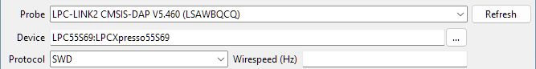
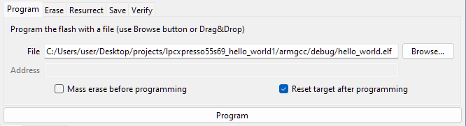
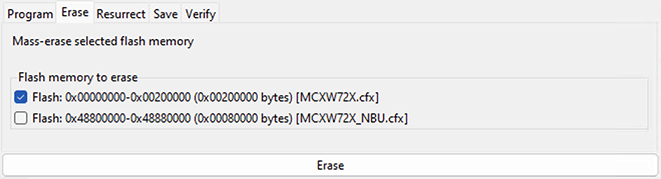
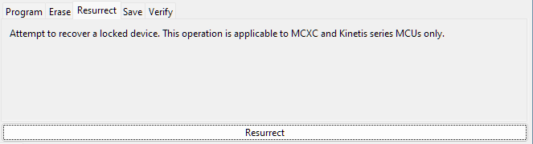
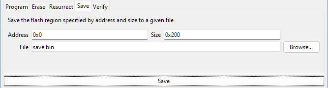
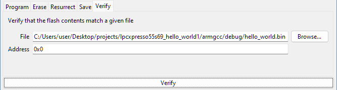
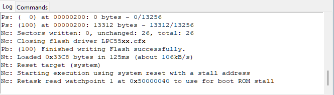
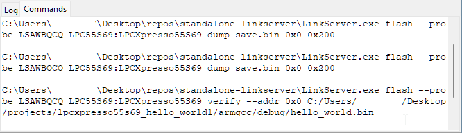

# Overview
*LinkFlash* is a flash programming utility for executing flash operations using the graphical user interface. It can be opened from a terminal using `./LinkFlash` or `./LinkServer gui flash`.

This document describes all the functionalities provided by *LinkFlash*.

# Application layout
The application window is composed of the following sections, in order from top to bottom:
* [Menu bar](#menu-bar)
* [Probe and Device options](#probe-and-device-options)
* [Flash commands](#flash-commands)
* [Logs](#logs)
* [Status bar](#status-bar)

## Menu bar
The following actions are available from the menu bar:
* `File`
	- `Load Configuration...` : Load a [configuration](#configuration) previously saved using `Save Configuration...`.

	- `Save Configuration...` : Save the current [configuration](#configuration) to a file.

	- `Reset Configuration` : Reset the [configuration](#configuration) to the initial state.

* `Help`
	- `About` : Show information about this application.

## Probe and Device options
Fields to select the probe, device, and connection options.

* `Probe` : A combobox that displays the currently connected LinkServer probes. The `Refresh` button triggers a new scan for probes. The probes are automatically scanned once, when the application starts.

* `Device` : A text-combobox hybrid field that allows filtering. Once it is clicked, it displays a dropdown with all the available devices. Inputting text into the field filters the options. The `...` button can also be used to toggle the dropdown.

* `Protocol` : Select the protocol to be used (`SWD` or `JTAG`). For most devices, only `SWD` option is available.

* `Wirespeed` : Wirespeed in Hertz. If the field is left empty, the default wirespeed specified in the device's JSON configuration is used.

## Flash commands
The flash command to execute is selected by clicking on the different tabs. The options for the currently selected command are displayed under the tabs.

The following commands are available: `Program`, `Erase`, `Resurrect`, `Save`, `Verify`.

#### Command execution
The selected command is initiated when clicking the large button located below the command's options. While executing, the button name changes to `Cancel` and it can be pressed to **cancel** the operation.

#### Input validation
The input fields are validated only after clicking the command execution button.
If errors are found, the flash command is not executed and a pop-up message is shown with all the errors that need to be fixed.

Possible errors include: empty required fields, non-existent input files, badly formatted numbers, etc.

### Program
Program the flash with a file.

Options:
* `File` : File to be programmed. The `Browse...` button can be used to select a file using a file dialog. Alternatively, the file can be **dragged and dropped** onto the *LinkFlash* window.

* `Address` : Load address for the binary file. Can be hex (0x), binary (0b) or decimal. This field is enabled only when the file's extension is not recognized as an ELF, HEX, or SREC file, in which case the file is considered binary.

* `Mass erase before programming` : Erase all flash before programming.

* `Reset target after programming` : Start execution from reset after programming.

### Erase
Mass-erase selected flash memory.

Options:
* `Flash memory to erase`: Select the flash memories to mass-erase. By default, only the first flash memory is selected. For targets with TrustZone support, only the non-secure address ranges are shown, since secure and non-secure addresses are aliases for the same physical flash memory.

### Resurrect
Attempt to recover a locked device. This operation is applicable to MCXC and Kinetis series MCUs only.

### Save
Save the flash region specified by address and size to a given file.

Options:
* `Address` : Address to start saving from. Can be hex (0x), binary (0b) or decimal.

* `Size` : Size of the region to save. Can be hex (0x), binary (0b) or decimal.

* `File` : File to save the binary data to. The `Browse...` button can be used to select a file using a file dialog.

### Verify
Verify that the flash contents match a given file.

Options:
* `File` : File to verify. The `Browse...` button can be used to select a file using a file dialog.

* `Address` : Load address of the binary file. Can be hex (0x), binary (0b) or decimal. This field is enabled only when the file's extension is not recognized as an ELF, HEX, or SREC file, in which case the file is considered binary.

## Logs
These tabs provide information about the executed commands. Two tabs are available:
* `Log` : Displays low-level information of the last executed flash command.

	

* `Commands` : Displays a history of all the flash commands executed in the current session. The commands invoke *LinkServer* and can be used from a terminal to replicate the operations performed in the graphical user interface.

	

## Status bar
Displays the status of the last executed command.

# Configuration
The **configuration** refers to the values selected for: probe, device, protocol, wirespeed, the options of each individual command, as well as the command itself.

## Startup configuration
The current configuration is automatically saved into `<path_to_user_home_folder>/.linkserver/.gui_flash_last_sess.json` before exiting. This configuration is then automatically loaded when the application is re-launched.

A different configuration file can be loaded at startup using the `--config FILE` option. For saving configurations, see the `File > Save Configuration...` action from the [Menu Bar](#menu-bar).

Example: `./LinkServer gui flash --config my_saved_state.json`

# CLI options
Options for the `./LinkServer gui flash` command:
* `--config` : [Configuration](#startup-configuration) file to load at startup.
* `--help` : Display the help for this command.